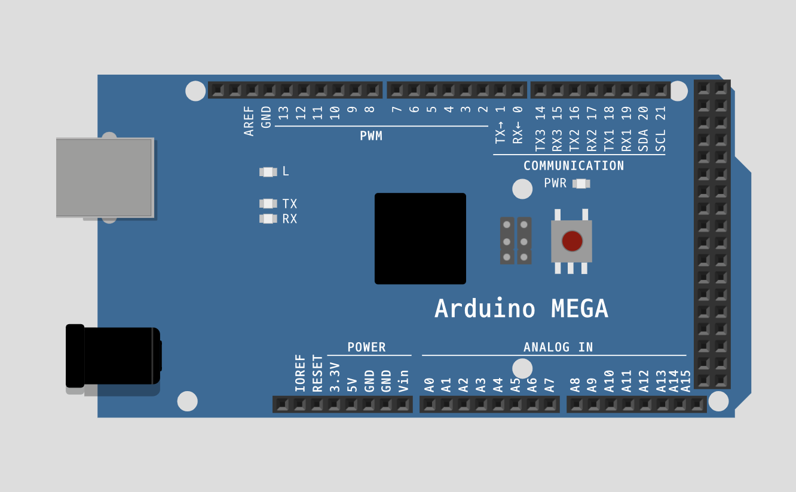

## This is a directory about `Arduino`

---
## Class dependency diagram

<p align="center">
    
</p>

## Essential library
|Name|Description|Dependency|
|:---:|---|:---:|
|[`ArduinoJson`](https://arduinojson.org/)|ArduinoJson is a C++ JSON library for Arduino and IoT (Internet Of Things).|[`Raspberry_pi_Json`](./lib/Raspberry_pi_Json/)|
|[`Servo`](https://www.arduino.cc/reference/en/libraries/servo/)|Allows Arduino boards to control a variety of servo motors.|[`sensor_servo_bundle`](./lib/Bundle_refactor/src/sensor_servo_bundle/)|

---
## File description
1. [`lib`](./lib/)  :   A directory that contains library we made.
    - [`Bundle_refactor`](./lib/Bundle_refactor/)   :   A library that contains `BLDC Motor & Power LED control`, `Step Motor control`.
    
    - [`Raspberry_pi_Json`](./lib/Raspberry_pi_Json/)   :   A library that contains `Serial communication with Raspberry PI`

    In each library, there's `example` directory that shows how to use it.
    
    - [`Arduino bundle Example code`](./lib/Bundle_refactor/Example)
    - [`Arduino serial communication Example code`](./lib/Raspberry_pi_Json/Example)
    - [`Arduino Examples with Online simulator`](#source-code-example-with-wokwi)

2. [`test`](./test/)    :   A directory that tested sourcode using [`PlatformIO IDE for VSCode`](https://docs.platformio.org/en/latest/integration/ide/vscode.html)
    
    - In directory, there's copy of [`lib`](./lib/) codes.

3. [`main.cpp`](./main.cpp) :   A source code to execute `Arduino`.

---
## BLDC Motor & LED control diagram - [`sensor_LED_bundle`](./lib/Bundle_refactor/src/sensor_LED_bundle/)

<p align="center">
    
</p>

---
## Step Motor control diagram - [`sensor_servo_bundle`](./lib/Bundle_refactor/src/sensor_servo_bundle/)

<p align="center">
    
</p>

---
## Serial communication diagram - [`Raspberry_pi_Json`](./lib/Raspberry_pi_Json/)

<p align="center">
    
</p>

---
## Source code example with [`Wokwi`](https://wokwi.com/)

- [`Wokwi`](https://wokwi.com/) is a online IoT simulator

- [`sensor_led_ex.cpp`](./lib/Bundle_refactor/Example/sensor_led_ex.cpp), [`link`](https://wokwi.com/projects/379994211146222593)

<p align="center">
    
</p>

- [`sensor_servo_ex.cpp`](./lib/Bundle_refactor/Example/sensor_servo_ex.cpp), [`link`](https://wokwi.com/projects/380078546995202049)

<p align="center">
    
</p>


- [`sensor_led_servo_ex.cpp`](./lib/Bundle_refactor/Example/sensor_led_servo_ex.cpp), [`link`](https://wokwi.com/projects/380118249583351809)

<p align="center">
    
</p>

- [`Raspberry_pi_Json_ex_arduino.cpp`](./lib/Raspberry_pi_Json/Example/Raspberry_pi_Json_ex_arduino.cpp), [`link`](https://wokwi.com/projects/380111390036382721)

<p align="center">
    
</p>

- [`Raspberry_pi_Json_ex_with_bundle.cpp`](./lib/Raspberry_pi_Json/Example/Raspberry_pi_Json_ex_with_bundle.cpp), [`link`](https://wokwi.com/projects/380119484960149505)

<p align="center">
    
</p>

---
## Whole file tree
```
[ 192]  .
├── [7.0K]  README.md
├── [4.0K]  main.cpp
├── [ 128]  lib
│   ├── [ 160]  Bundle_refactor
│   │   ├── [ 160]  Example
│   │   │   ├── [ 912]  sensor_led_ex.cpp
│   │   │   ├── [1.5K]  sensor_led_servo_ex.cpp
│   │   │   └── [ 890]  sensor_servo_ex.cpp
│   │   └── [ 224]  src
│   │       ├── [ 326]  bundle_refactor.h
│   │       ├── [ 128]  base
│   │       │   ├── [3.9K]  base.cpp
│   │       │   └── [1023]  base.h
│   │       ├── [ 128]  sensor_LED_bundle
│   │       │   ├── [5.1K]  sensor_LED_bundle.cpp
│   │       │   └── [1.2K]  sensor_LED_bundle.h
│   │       └── [ 128]  sensor_servo_bundle
│   │           ├── [4.4K]  sensor_servo_bundle.cpp
│   │           └── [1.4K]  sensor_servo_bundle.h
│   └── [ 128]  Raspberry_pi_Json
│       ├── [ 160]  Example
│       │   ├── [1.3K]  Raspberry_pi_Json_ex_arduino.cpp
│       │   ├── [1.4K]  Raspberry_pi_Json_ex_raspberry_pi.ipynb
│       │   └── [2.8K]  Raspberry_pi_Json_ex_with_bundle.cpp
│       └── [ 128]  src
│           ├── [3.4K]  Raspberry_pi_Json.cpp
│           └── [1.3K]  Raspberry_pi_Json.h
└── [ 160]  test
    ├── [ 352]  test_mega
    │   ├── [ 285]  README.md
    │   ├── [ 524]  platformio.ini
    │   ├── [  96]  include
    │   │   └── [1.4K]  README
    │   ├── [ 192]  lib
    │   │   ├── [1.0K]  README
    │   │   ├── [ 160]  Bundle
    │   │   │   ├── [ 192]  Example
    │   │   │   │   ├── [6.8K]  Sensor_LED_Stepper_example.cpp
    │   │   │   │   ├── [ 479]  Sensor_LED_bundle_example.cpp
    │   │   │   │   ├── [ 362]  Sensor_Servo_bundle_example.cpp
    │   │   │   │   └── [ 623]  Sensor_Stepper_bundle_example.cpp
    │   │   │   └── [ 320]  src
    │   │   │       ├── [2.3K]  Base.h
    │   │   │       ├── [ 193]  Bundle.h
    │   │   │       ├── [2.6K]  Sensor_LED_bundle.cpp
    │   │   │       ├── [1.8K]  Sensor_LED_bundle.h
    │   │   │       ├── [1.9K]  Sensor_Servo_bundle.cpp
    │   │   │       ├── [1.1K]  Sensor_Servo_bundle.h
    │   │   │       ├── [4.3K]  Sensor_Stepper_bundle.cpp
    │   │   │       └── [2.1K]  Sensor_Stepper_bundle.h
    │   │   ├── [ 160]  Bundle_refactor
    │   │   │   ├── [ 160]  Example
    │   │   │   │   ├── [ 912]  sensor_led_ex.cpp
    │   │   │   │   ├── [1.5K]  sensor_led_servo_ex.cpp
    │   │   │   │   └── [ 890]  sensor_servo_ex.cpp
    │   │   │   └── [ 224]  src
    │   │   │       ├── [ 326]  bundle_refactor.h
    │   │   │       ├── [ 128]  base
    │   │   │       │   ├── [3.9K]  base.cpp
    │   │   │       │   └── [1023]  base.h
    │   │   │       ├── [ 128]  sensor_LED_bundle
    │   │   │       │   ├── [5.1K]  sensor_LED_bundle.cpp
    │   │   │       │   └── [1.2K]  sensor_LED_bundle.h
    │   │   │       └── [ 128]  sensor_servo_bundle
    │   │   │           ├── [4.4K]  sensor_servo_bundle.cpp
    │   │   │           └── [1.4K]  sensor_servo_bundle.h
    │   │   └── [ 128]  Raspberry_pi_Json
    │   │       ├── [ 160]  Example
    │   │       │   ├── [1.3K]  Raspberry_pi_Json_ex_arduino.cpp
    │   │       │   ├── [1.4K]  Raspberry_pi_Json_ex_raspberry_pi.ipynb
    │   │       │   └── [3.1K]  Raspberry_pi_Json_ex_with_bundle.cpp
    │   │       └── [ 128]  src
    │   │           ├── [3.4K]  Raspberry_pi_Json.cpp
    │   │           └── [1.3K]  Raspberry_pi_Json.h
    │   ├── [  96]  src
    │   │   └── [3.1K]  main.cpp
    │   └── [  96]  test
    │       └── [ 518]  README
    └── [ 352]  test_uno
        ├── [ 284]  README.md
        ├── [ 592]  platformio.ini
        ├── [  96]  include
        │   └── [1.4K]  README
        ├── [ 192]  lib
        │   ├── [1.0K]  README
        │   ├── [ 160]  Bundle
        │   │   ├── [ 192]  Example
        │   │   │   ├── [6.8K]  Sensor_LED_Stepper_example.cpp
        │   │   │   ├── [ 479]  Sensor_LED_bundle_example.cpp
        │   │   │   ├── [ 362]  Sensor_Servo_bundle_example.cpp
        │   │   │   └── [ 623]  Sensor_Stepper_bundle_example.cpp
        │   │   └── [ 320]  src
        │   │       ├── [2.3K]  Base.h
        │   │       ├── [ 193]  Bundle.h
        │   │       ├── [2.6K]  Sensor_LED_bundle.cpp
        │   │       ├── [1.8K]  Sensor_LED_bundle.h
        │   │       ├── [1.9K]  Sensor_Servo_bundle.cpp
        │   │       ├── [1.1K]  Sensor_Servo_bundle.h
        │   │       ├── [4.3K]  Sensor_Stepper_bundle.cpp
        │   │       └── [2.1K]  Sensor_Stepper_bundle.h
        │   ├── [ 160]  Bundle_refactor
        │   │   ├── [ 160]  Example
        │   │   │   ├── [ 913]  sensor_led_ex.cpp
        │   │   │   ├── [1.5K]  sensor_led_servo_ex.cpp
        │   │   │   └── [ 890]  sensor_servo_ex.cpp
        │   │   └── [ 224]  src
        │   │       ├── [ 326]  bundle_refactor.h
        │   │       ├── [ 128]  base
        │   │       │   ├── [4.1K]  base.cpp
        │   │       │   └── [1.0K]  base.h
        │   │       ├── [ 128]  sensor_LED_bundle
        │   │       │   ├── [5.2K]  sensor_LED_bundle.cpp
        │   │       │   └── [1.2K]  sensor_LED_bundle.h
        │   │       └── [ 128]  sensor_servo_bundle
        │   │           ├── [4.5K]  sensor_servo_bundle.cpp
        │   │           └── [1.4K]  sensor_servo_bundle.h
        │   └── [ 128]  Raspberry_pi_Json
        │       ├── [ 160]  Example
        │       │   ├── [1.3K]  Raspberry_pi_Json_ex_arduino.cpp
        │       │   ├── [1.4K]  Raspberry_pi_Json_ex_raspberry_pi.ipynb
        │       │   └── [3.1K]  Raspberry_pi_Json_ex_with_bundle.cpp
        │       └── [ 128]  src
        │           ├── [3.4K]  Raspberry_pi_Json.cpp
        │           └── [1.3K]  Raspberry_pi_Json.h
        ├── [ 160]  src
        │   ├── [4.1K]  main.cpp
        │   ├── [3.4K]  main2.cpp
        │   └── [ 412]  main3.cpp
        └── [  96]  test
            └── [ 518]  README

46 directories, 85 files```