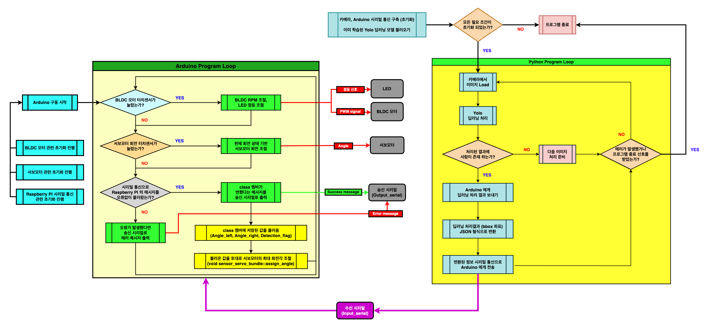
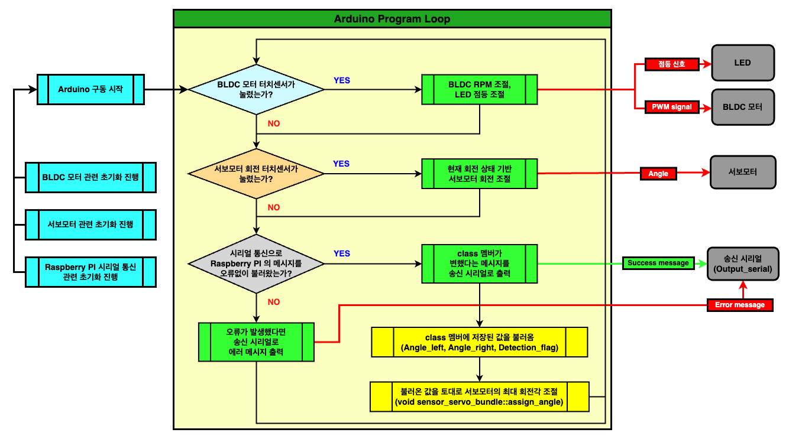
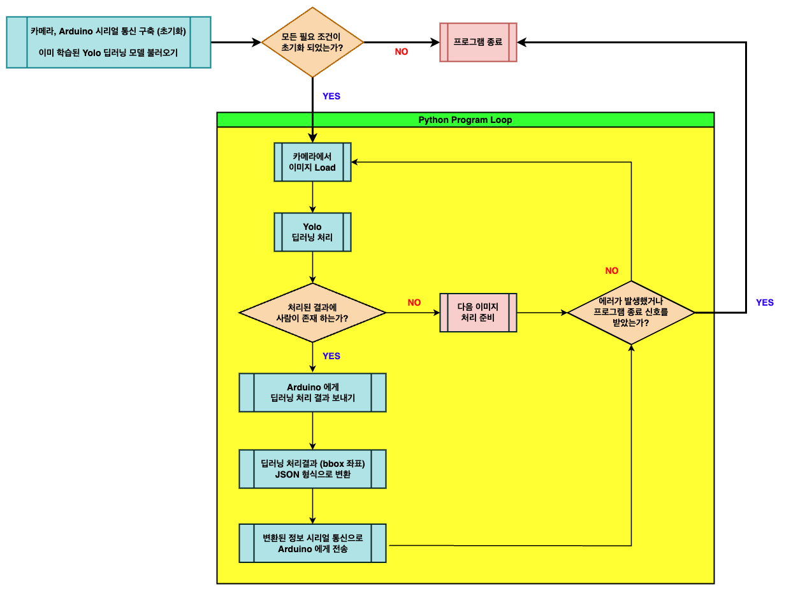

## 창의공학 종합 설계 - 이진 모드 스마트팬 (Binary mode Smart Fan)

- 제작 기간 : `2023.09 ~ 2023.12`

---
## 시연 연상

    

---
## Arduino file description
1. [`Arduino_src/lib`](./Arduino_src/lib/)  :   A directory that contains library we made.
    - [`Arduino_src/lib/Bundle_refactor`](./Arduino_src/lib/Bundle_refactor/)   :   A library that contains `BLDC Motor & Power LED control`, `Step Motor control`.
    
    - [`Arduino_src/lib/Raspberry_pi_Json`](./Arduino_src/lib/Raspberry_pi_Json/)   :   A library that contains `Serial communication with Raspberry PI`

    In each library, there's `example` directory that shows how to use it.
    
    - [`Arduino bundle Example code`](./Arduino_src/lib/Bundle_refactor/Example)
    - [`Arduino serial communication Example code`](./Arduino_src/lib/Raspberry_pi_Json/Example)
    - [`Arduino Examples with Online simulator`](./Arduino_src/README.md#source-code-example-with-wokwi)

2. [`Arduino_src/test`](./Arduino_src/test/)    :   A directory that tested sourcode using [`PlatformIO IDE for VSCode`](https://docs.platformio.org/en/latest/integration/ide/vscode.html)
    - In directory, there's copy of [`Arduino_src/lib`](./Arduino_src/lib/) codes.

3. [`Arduino_src/main.cpp`](./Arduino_src/main.cpp) :   A source code to execute `Arduino`.

---
## Raspberry PI file description
1. [`Raspberry_PI_src/best.pt`](./Raspberry_PI_src/best.pt)  :   A `Yolov8n` model to use image prediction. It's already trained.

2. [`Raspberry_PI_src/Raspi_Yolo.py`](./Raspberry_PI_src/Raspi_Yolo.py)   :   A source code to execute `Raspberry PI`.

3. [`Raspberry_PI_src/test`](./Raspberry_PI_src/test/)    :   A directory that used to test some image, FPS of `Yolov8n`, and others.

---
## 구동에 필요한 라이브러리
- [`Arduino`](./Arduino_src/)

|Name|Description|Dependency|
|---|---|---|
|[`ArduinoJson`](https://arduinojson.org/)|ArduinoJson is a C++ JSON library for Arduino and IoT (Internet Of Things).|[`Raspberry_pi_Json`](./lib/Raspberry_pi_Json/)|
|[`Servo`](https://www.arduino.cc/reference/en/libraries/servo/)|Allows Arduino boards to control a variety of servo motors.|[`sensor_servo_bundle`](./lib/Bundle_refactor/src/sensor_servo_bundle/)|

- [`Raspberry PI`](./Raspberry_PI_src/)

|Package|Description|Version|
|-------|---|------:|
|[`OpenCV-python`](https://github.com/opencv/opencv-python?tab=readme-ov-file)|OpenCV (Open Source Computer Vision Library: http://opencv.org) is an open-source BSD-licensed library that includes several hundreds of computer vision algorithms.|   4.8.1.78|
|[`Ultralytics`](https://github.com/ultralytics/ultralytics)|Ultralytics YOLOv8 is a cutting-edge, state-of-the-art (SOTA) model that builds upon the success of previous YOLO versions and introduces new features and improvements to further boost performance and flexibility.|   8.0.205|
|[`Pytorch`](https://github.com/pytorch/pytorch)|PyTorch is a Python package that provides Tensor computation (like NumPy) with strong GPU acceleration & Deep neural networks built on a tape-based autograd system|   2.0.1|
|[`Pyserial`](https://pyserial.readthedocs.io/en/latest/index.html)|This module encapsulates the access for the serial port.|    3.5|

---
## File description
1. [`Raspberry_PI_src/best.pt`](./Raspberry_PI_src/best.pt)  :   A `Yolov8n` model to use image prediction. It's already trained.

2. [`Raspberry_PI_src/Raspi_Yolo.py`](./Raspberry_PI_src/Raspi_Yolo.py)   :   A source code to execute `Raspberry PI`.

3. [`Raspberry_PI_src/test`](./Raspberry_PI_src/test/)    :   A directory that used to test some image, FPS of `Yolov8n`, and others.

---
## 전체 구동 다이어그램

    

## [`Arduino`](./Arduino_src/main.cpp) 구동 다이어그램

    

## [`Raspberry PI`](./Raspberry_PI_src/Raspi_Yolo.py) 구동 다이어그램

    

---
